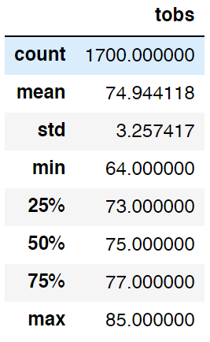
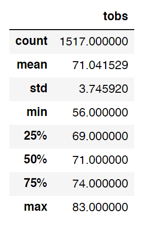
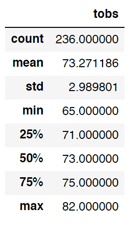
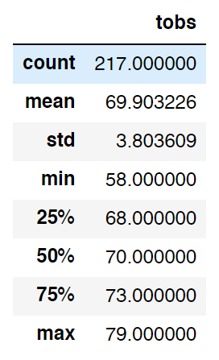

# Surfs Up Querries

## Overview

This analysis focuses on filtering sqlite querries from an sqlite file of weather recording stations on O'ahu and retrieves recorded temperatures from the months of June and December across every year of recording time.

## Results

* There is an average of about 4 degrees difference for each quartile as well as the mean between June and December

* June a minimum temperature 8 degrees higher than that of December

* Decembers average temperature is only 4 degrees less than June

June

December

## Summary

These statistics would seem to conclude that O'ahu has about a difference of 4 degrees between Summer and Winter. With the differences being universally slight of 4 degrees between the observation statistics for these two months, additional querries for confirmation of these findings may be ideal. With essentially the same querries focused on the station of greatest observation count, we have similar findings of small intervals of close to 3 degrees for interquartile ranges and the mean allongside a familiar difference of about 7 or 8 degrees for the minimum temperatures.

June Station

December Station

